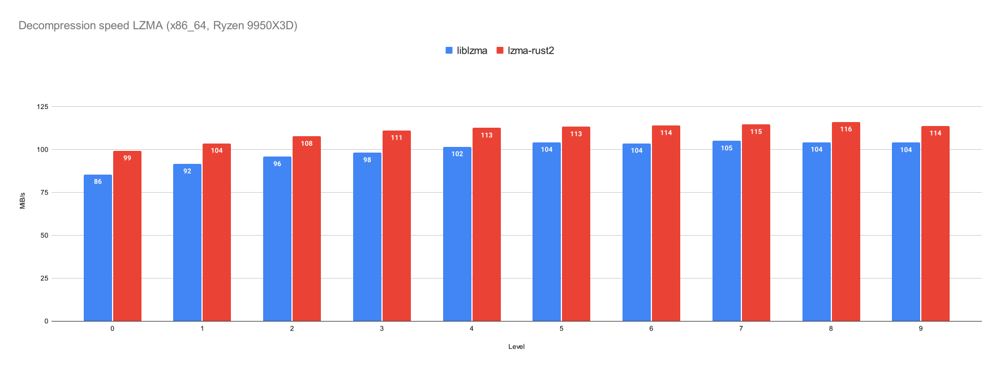
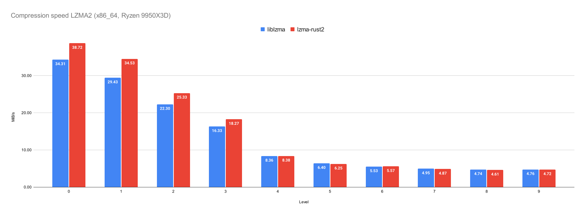

# LZMA / LZMA2 / XZ in native Rust

LZMA / LZMA2 / LZIP/ XZ compression ported from [tukaani xz for java](https://tukaani.org/xz/java.html).

This is a fork of the original, unmaintained lzma-rust crate to continue the development and maintenance.

## Safety

Only the `optimization` feature uses unsafe Rust features to implement optimizations, that are
not possible in safe Rust. Those optimizations are properly guarded and are of course sound.
This includes creation of aligned memory, handwritten assembly code for hot functions and some
pointer logic. Those optimization are well localized and generally consider safe to use, even
with untrusted input.

Deactivating the `optimization` feature will result in 100% standard Rust code.

## Performance

The following part is strictly about single threaded performance. It supports multithreaded encoding and decoding
through the `LZMA2WriterMT` and `LZMA2ReaderMT` structs though.

When compared against the `liblzma` crate, which uses the C library of the same name, this crate has improved decoding
speed.

Encoding is also well optimized and is surpassing `liblzma` for level 0 to 3 and matches it for level 4 to 9.

Data was assembled using lzma-rust2 v0.4.0 and liblzma v0.4.2.

## no_std Support

This crate supports `no_std` environments by disabling the default `std` feature.

When used in `no_std` mode, the crate provides custom `Read`, `Write`, and `Error` types
(defined in `no_std.rs`) that are compatible with `no_std` environments. These types offer
similar functionality to their `std::io` counterparts but are implemented using only `core`
and `alloc`.

The custom types include:

- `Error`: A custom error enum with variants for different error conditions.
- `Read`: A trait similar to `std::io::Read`.
- `Write`: A trait similar to `std::io::Write`.

Default implementations for `&[u8]` (Read) and `&mut [u8]` (Write) are provided.

Note that multithreaded features are not available in `no_std` mode as they require
standard library threading primitives.

## License

Licensed under the [Apache License, Version 2.0](https://www.apache.org/licenses/LICENSE-2.0).
